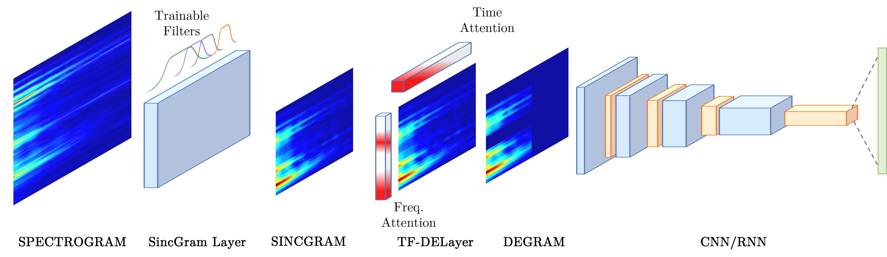

# DEGram - Torch

 
 
[](https://github.com/median-research-group/LibMTL) 

This repository contains the pytorch implementation of [DEGramNet: Effective audio analysis based on a fully learnable time-frequency representation](https://link.springer.com/article/10.1007/s00521-023-08849-7). 




### Table of Content
- [Method description](#method-description)
- [Requirements](#requirements)
- [Usage](#usage)
- [Getting started](#getting-started)
- [Citations](#citations)


## Method description
DEGramNet is an innovative convolutional architecture for audio analysis tasks, addressing the limitations of current state-of-the-art algorithms. Unlike traditional hand-crafted Spectrogram-like representations, DEGramNet utilizes a novel, compact, and trainable time-frequency representation called DEGram. This representation overcomes the drawbacks of fixed filter parameters by dynamically learning the frequencies of interest specific to the audio analysis task. DEGramNet incorporates a custom time-frequency attention module within the DEGram representation, enabling it to perform denoising on the audio signal in both the time and frequency domains. By amplifying the relevant frequency and time components of the sound, DEGramNet effectively improves the generalization capabilities, especially when training data is limited. Moreover, this flexibility allows the representation to adapt easily to different audio analysis problems, such as emphasizing voice frequencies for speaker recognition.

## Requirements

To install the requirements:

```bash
git clone https://github.com/robertanto/DEGramNet-torch.git
cd DEGramNet-torch
pip install -r requirements.txt
```

## Usage

Try it on Google Colab [here](https://colab.research.google.com/drive/1K9bB4C6mFDwMNMstCv6OpQzs5zy6vEPi?usp=sharing)!

```python
model = DEGramBasedModel(
    backbone,
    sincgram=True,
    attention=True,
    filters=64,
    order=4,
    num_spectrogram_bins=1025,
    sample_rate=16000,
    reduction_ratio=1/16,
    normalization=True,
    device='cpu'
)
``` 

- *backbone*: Neural model taking as input a tensor of shape (batch, 1, freq, time)
- *sincgram*: True to use SincGram, False instead
- *attention*: True to apply the TF-DELayer, False instead
- *filters*: Number of filters in the SincGram layer  
- *order*: Butterworth window order
- *num_spectrogram_bins*: Number of input spectrogram bins (n_fft//2+1)
- *sample_rate*: Input sample rate
- *reduction_ratio*: Compression ratio to use in the TF-DELayer
- *normalization*: True to normalize the output representation, False instead
- *device*: Torch module device
- *other*: See the source code for more details

## Getting started

```python
import torch

from degramnet_torch.audio_utils import waveform_to_Spectrogram
from degramnet_torch.degram import DEGramBasedModel
from degramnet_torch.resnet import resnet18

# CNN backbone
backbone = resnet18(num_classes=10)

# Get the DEGram based model
model = DEGramBasedModel(
    backbone,
    sincgram=True,
    attention=True,
    num_spectrogram_bins=1025,
    sample_rate=16000,
    device='cpu'
)

# 10 Seconds audio sampled at 16KHz
batch_size = 1
time_size = 160000

# Spectrogram processing
spectTransform = waveform_to_Spectrogram(
    sr=16000,
    win_sec=0.032,
    hop_sec=0.010,
    n_fft =2048
)

# Random signal transformation
x = torch.randn(batch_size, time_size)
spect = spectTransform(x).unsqueeze(1) # add channel dim

# Model output
out = model(spect)
out[0].shape
``` 


### Citations

If you use this code in your research, please cite these papers.


```bibtext
@article{foggia2023degramnet,
  title={Degramnet: effective audio analysis based on a fully learnable time-frequency representation},
  author={Foggia, Pasquale and Greco, Antonio and Roberto, Antonio and Saggese, Alessia and Vento, Mario},
  journal={Neural Computing and Applications},
  pages={1--13},
  year={2023},
  publisher={Springer}
}

@article{greco2021denet,
  title={DENet: a deep architecture for audio surveillance applications},
  author={Greco, Antonio and Roberto, Antonio and Saggese, Alessia and Vento, Mario},
  journal={Neural Computing and Applications},
  doi={10.1007/s00521-020-05572-5},
  pages={1--12},
  year={2021},
  publisher={Springer}
}
```
